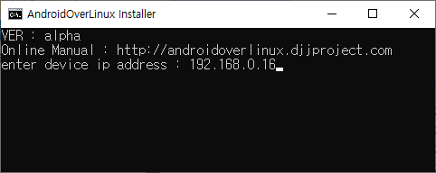
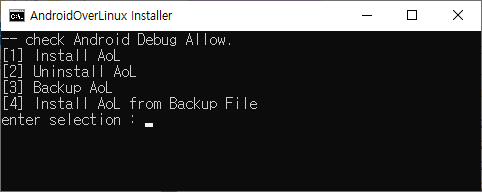

# AndroidOverLinux_amlogic
- alpha version

## How to insall
- Run install_aol.bat
- type IP address of Amlogic Android Device  
  
- Check Android Debugging prompt (Allow)
- Select Menu (install,uninstall,backup,backupinstall)  
  

